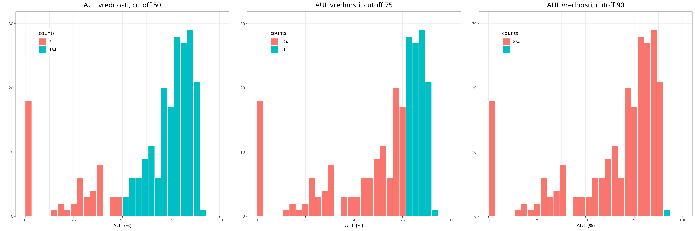

---
output:
    html_document:
        font: "IBM Plex Sans"
        toc: true
---

# Format podatkov

CSV (`sword_results.csv`) iz JSON datotek, ki jih vrne SWORD2. Vrstice se združujejo po proteinih in proteini po particijah.

| stolpec | opis |
|:------- |:---- |
| protein | PDB koda ter veriga, ki je bila uporabljena za SWORD2 |
| aindex | ambiguity index proteina |
| partition | indeks particije. Optimalna ima 0, alternativne 1 ali več |
| quality | ocena particije |
| domain | indeks domene. Prva domena 1, druga domena 2, ... |
| AUL | AUL vrednost domene |
| start | prva aminokislina domene |
| end | zadnja aminokislina domene |

Primer za 1a62_A:

```
protein aindex partition quality domain AUL start end
1a62_A  1      0         0       1      81  1     130 <---| opt.
1a62_A  1      1         1       1      70  1     47 <----| alt. 1
1a62_A  1      1         1       2      0   48    94      |
1a62_A  1      1         1       3      46  95    130     |
1a62_A  1      2         3       1      72  1     47 <----| alt. 2
1a62_A  1      2         3       2      8   48    130     |
1a62_A  1      3         1       1      76  1     130 <---| alt. 3
1a62_A  1      3         1       2      0   48    94      |
```

# Filtriranje glede na sledeče pogoje

1. več kot ena domena v particiji
2. razmerje med katerokoli domeno v particiji naj ne bo večje od 1:2 (največ 1:3)
3. ambiguity index med 1 in 3
4. AUL vrednosti domen vsaj 75 (najmanj 50)

Prvotno je na voljo 1938 proteinov (glej `Groups`).

```{r message=FALSE, warning=FALSE}
library(dplyr)
library(ggplot2)

# getwd()
# setwd("..")

# WARN: beri build_decompositions_csv.py za format
csv <- read.csv("sword_results.csv", header = TRUE) |>
    as_tibble() |>
    group_by(protein)
csv
```

Uporabil sem **samo optimalne particije.**

## Število Domen

Ostane jih 560 z dvema ali več domenami.

```{r}
md_opt <- csv |>
    filter(partition == 0) |>
    filter(max(domain) > 1)
md_opt
table(md_opt$domain)
```

## Razmerja med velikostmi domen

```{r}
prot_group <- function(d, p) {
    d[d$protein == p, ]
}

# razmerje določa cutoff parameter, med 0 in 1
check_ratios <- function(df, cutoff = 0.3) {
    keep <- c()
    for (prot in unique(df$protein)) {
        d2 <- prot_group(df, prot) |> as.data.frame() # tu nočem tibble

        # velikosti domen
        dsizes <- d2$end - d2$start + 1 # ker je 1-based

        # kombinacije vseh domen: (1,2), (1,3), (2,3) ...
        # transponirano, da je dimenzije N×2
        m <- combn(d2$domain, m = 2) |> t()

        # razmerje manjša/večja domena, da je rezultat v intervalu [0,1]
        ratios <- apply(m, 1, \(x) min(dsizes[x]) / max(dsizes[x]))

        # ohrani protein, če so razmerja primerna
        if (all(ratios > cutoff)) {
            keep <- c(keep, prot)
        }
    }
    keep
}
```

```{r}
# manj strogo
keep03 <- check_ratios(md_opt, cutoff = 0.3)
length(keep03) # koliko jih ostane
length(unique(md_opt$protein)) - length(keep03) # koliko jih odpade
md_opt[which(md_opt$protein %in% keep03), ]

# bolj strogo
keep05 <- check_ratios(md_opt, cutoff = 0.5)
length(keep05) # koliko jih ostane
length(unique(md_opt$protein)) - length(keep05) # koliko jih odpade
md_opt[which(md_opt$protein %in% keep05), ]
```

Tu sem se odločil ohraniti tiste, katerih razmerja so večja od 1:2.
Zaradi tega jih izgubim 184, ki bi jih sicer ohranil, če bi uporabil 1:3.

```{r}
kept03 <- md_opt[which(md_opt$protein %in% keep03), ]
kept05 <- md_opt[which(md_opt$protein %in% keep05), ]
setdiff(kept03, kept05)
```

```{r}
md_keep <- kept05
```

## A-index

Ohranim tiste, katerih A-index je največ 3. Odstranim jih še 51.

```{r}
md_keep$aindex |> table()
md_keep <- filter(md_keep, aindex < 4)
md_keep
```

## AUL vrednosti

Vse domene v particiji morajo imeti zadostne/dobre AUL vrednosti. 
Za zadostne sem uporabil mejo 50, za dobre pa 75.

Vzel sem najslabšo AUL vrednost med domenami v particiji. Če je najslabša večja
od meje, potem protein ohranim.

```{r}
bad_doms <- data.frame()

for (prot in unique(md_keep$protein)) {
    df <- prot_group(md_keep, prot)

    # najdi najslabšo domeno
    bad_dom <- which(df$AUL == min(df$AUL))[1]

    # dodaj na seznam
    bad_doms <- rbind(bad_doms, df[bad_dom, ])
}

bad_doms
bad_doms$AUL |> summary()

# zajame vse proteine
all(group_keys(bad_doms) == group_keys(md_keep))

# ni duplikatov
all(bad_doms$protein == unique(bad_doms$protein))
```

<!-- naredi to še enkrat -->

```{r eval=FALSE}
for (c in c(50, 75, 90))
{
    cutoff <- c

    # razdeli na dva dela glede na mejo
    n_below <- sum(bad_doms$AUL <= cutoff)
    n_above <- sum(bad_doms$AUL > cutoff)

    ggplot(bad_doms, aes(x = AUL)) +
        geom_histogram(aes(fill = after_stat(x) > cutoff),
            breaks = seq(0, 100, length.out = 31),
            color = "white",
            linewidth = 0.4
        ) +
        scale_fill_hue(labels = c(n_below, n_above)) +
        scale_y_continuous(expand = expansion(mult = c(0, 0.1))) +
        labs(
            title = paste("AUL vrednosti, cutoff", cutoff),
            x = "AUL (%)",
            y = "",
            fill = "counts"
        ) +
        theme_bw() +
        theme(
            plot.title = element_text(hjust = 0.5, size = 15),
            legend.position = c(0.15, 0.85),
            legend.background = element_rect(fill = "white"),
        )
    ggsave(filename = paste0("aul", cutoff, ".png"))
}
```

```
$ magick aul50.png aul75.png aul90.png +append aul_distribution.png
```



Ostane jih 184 z zadostnimi oziroma 111 z dobrimi AUL vrednostmi.

```{r}
sel <- bad_doms[which(bad_doms$AUL > 75), ]
final05_75 <- filter(md_keep, protein %in% sel$protein)
final05_75
```

```{r eval=FALSE}
write.csv(
    file = "clean_dataset.csv",
    x = final05_75,
    sep = ",",
    quote = FALSE,
    row.names = FALSE
)
```

# Koliko jih odpade zaradi 1:2 pogoja?

```{r}
md_keep <- kept03
md_keep <- filter(md_keep, aindex < 4)
bad_doms <- data.frame()

for (prot in unique(md_keep$protein)) {
    df <- prot_group(md_keep, prot)
    bad_dom <- which(df$AUL == min(df$AUL))[1]
    bad_doms <- rbind(bad_doms, df[bad_dom, ])
}

sel <- bad_doms[which(bad_doms$AUL > 75), ]
final03_75 <- filter(md_keep, protein %in% sel$protein)

setdiff(final03_75, final05_75)
```

# Koliko jih odpade zaradi 1:2 in meje 75?

```{r}
md_keep <- kept03
md_keep <- filter(md_keep, aindex < 4)
bad_doms <- data.frame()

for (prot in unique(md_keep$protein)) {
    df <- prot_group(md_keep, prot)
    bad_dom <- which(df$AUL == min(df$AUL))[1]
    bad_doms <- rbind(bad_doms, df[bad_dom, ])
}

sel <- bad_doms[which(bad_doms$AUL > 50), ]
final03_50 <- filter(md_keep, protein %in% sel$protein)

setdiff(final03_50, final05_75)
```
